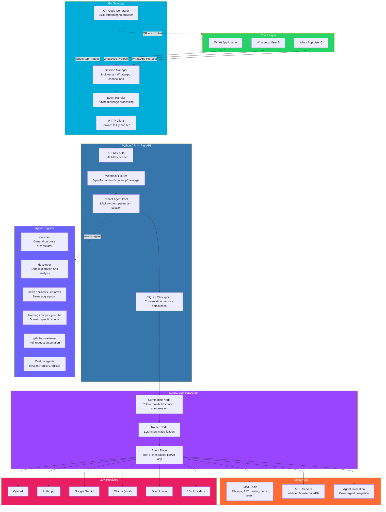

<div align="center">  

# WhaAgent

**Multi-tenant WhatsApp AI platform**

[](https://python.org)
[](https://go.dev)
[](https://fastapi.tiangolo.com)
[](https://github.com/langchain-ai/langgraph)
[](LICENSE)
[](https://github.com/MusadiqUrRahman/whaagent/actions)

</div>

---

## Overview

WhaAgent connects AI agents to WhatsApp. A Go gateway handles the WhatsApp protocol. A Python API runs LangGraph-powered agents. Multiple WhatsApp numbers, multiple AI agents, single deployment.

```
User sends WhatsApp message
        |
        v
Go Gateway (whatsmeow) --> Python API (FastAPI) --> AI Agent (LangGraph)
        |                                                  |
        v                                                  v
Response sent back via WhatsApp                    Tools / LLM / Memory
```

---

## Architecture



---

## Message Flow

```
1. User sends message to linked WhatsApp number
2. Go Gateway receives message via WhatsApp protocol (whatsmeow)
3. Gateway forwards to Python API via HTTP POST
4. API authenticates request, resolves tenant
5. Tenant Agent Pool provides the correct agent instance
6. LangGraph executes: Summarize -> Router -> Agent
7. Router classifies intent (chat / tool_use / research / delegate)
8. Agent executes tools, calls LLM, generates response
9. Response flows back: Agent -> API -> Gateway -> WhatsApp -> User
```

---

## Installation

### Option A: Docker

```bash
git clone https://github.com/MusadiqUrRahman/whaagent.git
cd whaagent
docker compose up -d
```

Docker builds both the Go gateway and Python API in a single container. Exposes port `8000`.

### Option B: Manual Setup

**Prerequisites:**
- Python 3.12+
- Go 1.21+
- [uv](https://docs.astral.sh/uv/) package manager

```bash
# Clone
git clone https://github.com/MusadiqUrRahman/whaagent.git
cd whaagent

# Install Python dependencies
uv sync

# Build Go gateway
make gateway-build
```

---

## Configuration

### 1. Environment Variables

Copy `.env.example` to `.env` and set your LLM API key:

```bash
cp .env.example .env
```

```env
# Required — your LLM provider API key
OPENAI_API_KEY=sk-...

# Optional — use OpenRouter for access to multiple providers
# OPENAI_BASE_URL=https://openrouter.ai/api/v1

# Optional — use Ollama for local inference (no API key needed)
# OPENAI_BASE_URL=http://localhost:11434/v1
```

### 2. Application Config

Run the interactive setup wizard:

```bash
whaagent init
```

This generates `~/.whaagent.yaml`:

```yaml
llm:
  provider: openai
  model: gpt-4o-mini
  temperature: 0.1

api:
  host: 127.0.0.1
  port: 8000

auth:
  api_keys:
    "your-api-key": "tenant-id"

whatsapp:
  tenants:
    - id: personal
      phone: "+1234567890"
      default_agent: assistant
    - id: business
      phone: "+0987654321"
      default_agent: assistant
```

### 3. Link WhatsApp

Start the services, then open the QR code page in your browser:

```bash
# Start Python API
whaagent serve

# Start Go gateway (in another terminal)
cd gateway && go run .
```

Open `http://localhost:8000/api/v1/whatsapp/qr/personal/page`, scan with WhatsApp (Settings > Linked Devices).

---

## Agents

WhaAgent ships with 12 built-in agents. Each agent has a system prompt, tool access, and can be customized.

### Built-in Agents

| Agent | Purpose |
|-------|---------|
| `assistant` | General-purpose orchestrator, routes to tools and sub-agents |
| `developer` | Code exploration, file analysis, development tasks |
| `committer` | Git commit message generation |
| `news` | News aggregation and summarization |
| `br-news` | Brazilian Portuguese news |
| `es-news` | Spanish news |
| `learning` | Educational content and explanations |
| `recipe` | Recipe generation and cooking assistance |
| `youtube` | YouTube transcript extraction and analysis |
| `github-pr-reviewer` | Automated pull request review |
| `paywall_remover` | Paywall bypass for web content |
| `ollama` | Local LLM via Ollama |

### Agent Configuration

Assign agents to WhatsApp numbers in `~/.whaagent.yaml`:

```yaml
whatsapp:
  tenants:
    - id: sales
      phone: "+1234567890"
      default_agent: assistant        # uses assistant agent
    - id: support
      phone: "+0987654321"
      default_agent: developer        # uses developer agent
```

### Creating Custom Agents

```python
from whaagent import AgentBase, AgentRegistry

@AgentRegistry.register("my-agent")
class MyAgent(AgentBase):
    @property
    def system_prompt(self) -> str:
        return "You are a specialized agent for my use case."

    def local_tools(self) -> list:
        return []  # optional custom tools
```

Place the file in `src/whaagent/agents/` and it auto-registers on startup.

---

## CLI Commands

```bash
whaagent init              # Interactive setup wizard
whaagent serve             # Start the API server (port 8000)
whaagent chat "message"    # Chat with AI locally
whaagent list              # List all registered agents
whaagent info <agent>      # Show agent details
```

---

## API Endpoints

| Method | Endpoint | Description |
|--------|----------|-------------|
| `GET` | `/health` | Health check |
| `GET` | `/ready` | Readiness probe |
| `GET` | `/api/v1/whatsapp/qr/{tenant_id}/page` | QR code viewer (browser) |
| `GET` | `/api/v1/whatsapp/qr/{tenant_id}` | SSE QR code stream |
| `POST` | `/api/v1/channels/whatsapp/message` | Incoming message webhook |
| `POST` | `/api/v1/channels/whatsapp/audio` | Audio message webhook |

---

## System Design

### Go Gateway

Built on [whatsmeow](https://github.com/tulir/whatsmeow) for direct WhatsApp protocol access.

- Multi-tenant session management — concurrent connections for multiple phone numbers
- LID-based JID resolution — handles WhatsApp's Linked Identity Device format
- Async event pipeline — long LLM calls do not block incoming message processing
- Persistent typing indicators — re-sent every 3 seconds during agent inference
- Session recovery — survives restarts via device reuse

### Python API

FastAPI server with dependency injection and async request handling.

- Tenant agent pool — LRU eviction, per-tenant isolated agent instances
- SSE QR streaming — real-time QR code delivery to browser
- API key authentication — gateway-to-API security
- Health/readiness endpoints — Kubernetes-ready probes
- Checkpoint persistence — SQLite-backed conversation memory

### Agent Framework

LangGraph-powered 3-node state graph:

```
Summarize -> Router -> Agent
```

- **Summarize node** — token threshold check, compresses old messages to ~128 tokens
- **Router node** — LLM-classified intent (chat, tool_use, research, delegate)
- **Agent node** — tool orchestration, sub-agent delegation, ReAct loop

### Tool Layers

| Layer | Description |
|-------|-------------|
| **Local Tools** | File operations, AST parsing, code search (ripgrep), syntax validation (tree-sitter) |
| **MCP Servers** | Model Context Protocol — web fetch, external APIs, custom integrations |
| **Agent Invocation** | Cross-agent delegation with isolated execution contexts |

---

## Tech Stack

| Component | Technology | Role |
|-----------|-----------|------|
| Gateway | Go + whatsmeow | WhatsApp protocol, session management |
| API | FastAPI + uvicorn | Async HTTP server, webhook handling |
| Agents | LangGraph + LangChain | State graph, tool orchestration, memory |
| Tools | tree-sitter, ripgrep | Code analysis, search |
| MCP | Model Context Protocol | External tool integration |
| Storage | SQLite | Checkpoint persistence, tenant data |
| LLM | 10+ providers | OpenAI, Anthropic, Google, Ollama, OpenRouter, etc. |
| Testing | pytest + mypy + ruff | 80% coverage, strict types, lint |

---

## Project Structure

```
whaagent/
├── src/whaagent/
│   ├── agents/                 # Agent implementations
│   │   ├── assistant.py        # General-purpose orchestrator
│   │   ├── developer.py        # Code exploration and analysis
│   │   ├── news.py             # News aggregation
│   │   ├── youtube.py          # YouTube transcript extraction
│   │   ├── github_pr_reviewer.py
│   │   └── ...
│   ├── api/
│   │   ├── server.py           # FastAPI app factory
│   │   ├── pool.py             # Tenant agent pool (LRU eviction)
│   │   ├── routes/
│   │   │   ├── whatsapp.py     # WhatsApp webhook handlers
│   │   │   └── agents.py       # Agent management endpoints
│   │   ├── auth.py             # API key authentication
│   │   └── deps.py             # Dependency injection
│   ├── graph.py                # 3-node StateGraph (Summarize/Router/Agent)
│   ├── agent.py                # AgentBase class, initialization, tool loading
│   ├── registry.py             # Agent discovery and registration
│   ├── config.py               # YAML config loading
│   ├── mcp/
│   │   ├── provider.py         # MCP connection management
│   │   └── config.py           # MCP server discovery
│   ├── tools/
│   │   ├── codebase_explorer.py
│   │   ├── code_searcher.py
│   │   └── manifest.py         # Tool manifest + circuit breaker
│   ├── llm/
│   │   └── providers.py        # 10+ LLM provider factories
│   ├── prompts/                # System prompts (.md files)
│   └── storage/
│       ├── database.py         # SQLite setup
│       └── scheduler.py        # Scheduled tasks
├── gateway/                    # Go WhatsApp gateway
│   ├── main.go                 # Entry point
│   ├── session.go              # Multi-tenant session management
│   ├── message.go              # Message handling + self-message detection
│   └── qr.go                   # QR code generation
├── tests/                      # Test suite
├── .env.example                # Environment variable template
├── docker-compose.yml          # Docker deployment
├── Dockerfile                  # Multi-stage build (Go + Python)
├── Makefile                    # Build commands
└── pyproject.toml              # Python project config
```

---

## Deployment

### Docker

```bash
docker compose up -d          # Start
docker compose logs -f        # Logs
docker compose down           # Stop
```

### Bare Metal (Linux VPS)

```bash
uv sync
make gateway-build

# Start services
whaagent serve &
cd gateway && go run . &

# Optional: systemd services for production
sudo cp deploy/*.service /etc/systemd/system/
sudo systemctl enable whaagent-api whaagent-gateway
sudo systemctl start whaagent-api whaagent-gateway
```

---

## Development

```bash
make install          # Install dependencies
make test             # Run tests with coverage
make check            # Lint + type check (mypy, ruff)
make format           # Auto-format code
make build            # Build wheel and sdist
```

---

## License

MIT

---

<div align="center">

[](https://python.langchain.com)
[](https://github.com/langchain-ai/langgraph)
[](https://go.dev)
[](https://fastapi.tiangolo.com)
[](https://modelcontextprotocol.io)

</div>
