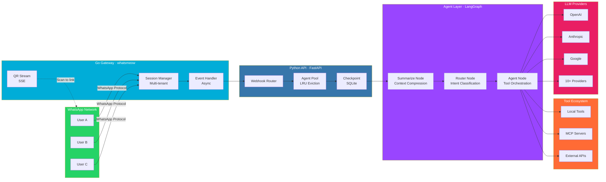

<div align="center">

# WhaAgent

**Production-grade multi-tenant WhatsApp AI platform**

[](https://python.org)
[](https://go.dev)
[](https://fastapi.tiangolo.com)
[](https://github.com/langchain-ai/langgraph)
[](LICENSE)
[](https://github.com/MusadiqUrRahman/whaagent/actions)

</div>

---

WhaAgent connects AI agents to WhatsApp. Multiple numbers, multiple tenants, single deployment. Go gateway for protocol reliability, Python for agent flexibility, LangGraph for reasoning orchestration.

---

## Architecture



---

## System Design

### Go Gateway

Built on [whatsmeow](https://github.com/tulir/whatsmeow) for direct WhatsApp protocol access.

- **Multi-tenant session management** — concurrent connections for multiple phone numbers
- **LID-based JID resolution** — handles WhatsApp's Linked Identity Device format
- **Async event pipeline** — long LLM calls don't block incoming message processing
- **Persistent typing indicators** — re-sent every 3s during agent inference
- **Session recovery** — survives restarts via device reuse

### Python API

FastAPI server with dependency injection and async request handling.

- **Tenant agent pool** — LRU eviction, per-tenant isolated instances
- **SSE QR streaming** — real-time QR code delivery to browser
- **API key authentication** — gateway-to-API security
- **Health/readiness endpoints** — Kubernetes-ready probes
- **Checkpoint persistence** — SQLite-backed conversation memory

### Agent Framework

LangGraph-powered 3-node state graph.

```
Summarize → Router → Agent
```

- **Summarize node** — token threshold check, compresses old messages to ~128 tokens
- **Router node** — LLM-classified intent (chat, tool_use, research, delegate)
- **Agent node** — tool orchestration, sub-agent delegation, ReAct loop

### Tool Ecosystem

| Layer | Tools |
|-------|-------|
| **Local** | File operations, AST parsing, code search (ripgrep), syntax validation (tree-sitter) |
| **MCP** | Model Context Protocol servers — web fetch, flight search, custom tools |
| **Agent Invocation** | Cross-agent delegation with isolated execution contexts |

---

## Tech Stack

| Component | Technology | Purpose |
|-----------|-----------|---------|
| Gateway | Go + whatsmeow | WhatsApp protocol, session management |
| API | FastAPI + uvicorn | Async HTTP server, webhook handling |
| Agents | LangGraph + LangChain | State graph, tool orchestration, memory |
| Tools | tree-sitter, ripgrep | Code analysis, search |
| MCP | Model Context Protocol | External tool integration |
| Storage | SQLite | Checkpoint persistence, tenant data |
| LLM | 10+ providers | OpenAI, Anthropic, Google, Ollama, etc. |
| Testing | pytest + mypy + ruff | 80% coverage, strict types, lint |

---

## Code Quality

- **Type-safe** — strict mypy checking, full type hints across all modules
- **Tested** — 80% coverage, unit + integration tests
- **Linted** — ruff for style, mypy for types
- **Async-first** — non-blocking I/O throughout
- **Error handling** — graceful degradation, circuit breakers for external services

---

## Project Structure

```
whaagent/
├── src/whaagent/
│   ├── agents/              # Agent implementations
│   │   ├── assistant.py     # General-purpose orchestrator
│   │   ├── developer.py     # Code exploration
│   │   ├── news.py          # News aggregation
│   │   └── ...
│   ├── api/
│   │   ├── server.py        # FastAPI app factory
│   │   ├── pool.py          # Tenant agent pool (LRU)
│   │   └── routes/          # REST endpoints
│   ├── graph.py             # 3-node StateGraph
│   ├── agent.py             # AgentBase class
│   ├── mcp/                 # MCP integration
│   │   ├── provider.py      # Connection management
│   │   └── config.py        # Server discovery
│   ├── tools/               # Built-in tools
│   │   ├── codebase_explorer.py
│   │   ├── code_searcher.py
│   │   └── manifest.py      # Tool manifest + circuit breaker
│   ├── llm/                 # LLM abstraction
│   │   └── providers.py     # 10+ provider factories
│   ├── prompts/             # System prompts (.md)
│   └── storage/             # SQLite persistence
├── gateway/                 # Go WhatsApp gateway
│   ├── main.go
│   ├── session.go           # Multi-tenant sessions
│   ├── message.go           # Message handling
│   └── qr.go                # QR code generation
└── tests/                   # Test suite
```

---

## Deployment

```bash
# Docker
docker compose up -d

# Bare metal
uv sync && make gateway-build
whaagent serve &
cd gateway && go run . &
```

---

## License

MIT

---

<div align="center">

[](https://python.langchain.com)
[](https://github.com/langchain-ai/langgraph)
[](https://go.dev)
[](https://fastapi.tiangolo.com)
[](https://modelcontextprotocol.io)

</div>
